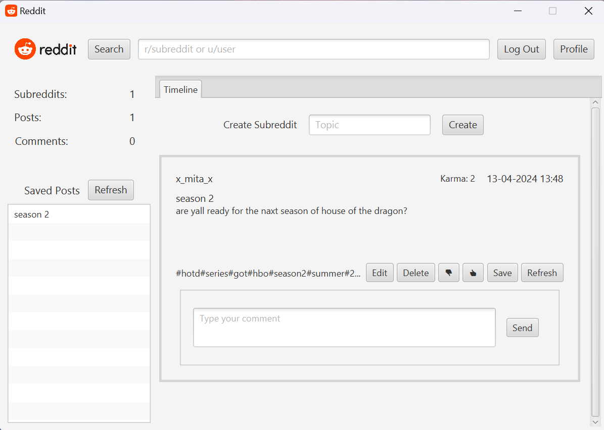
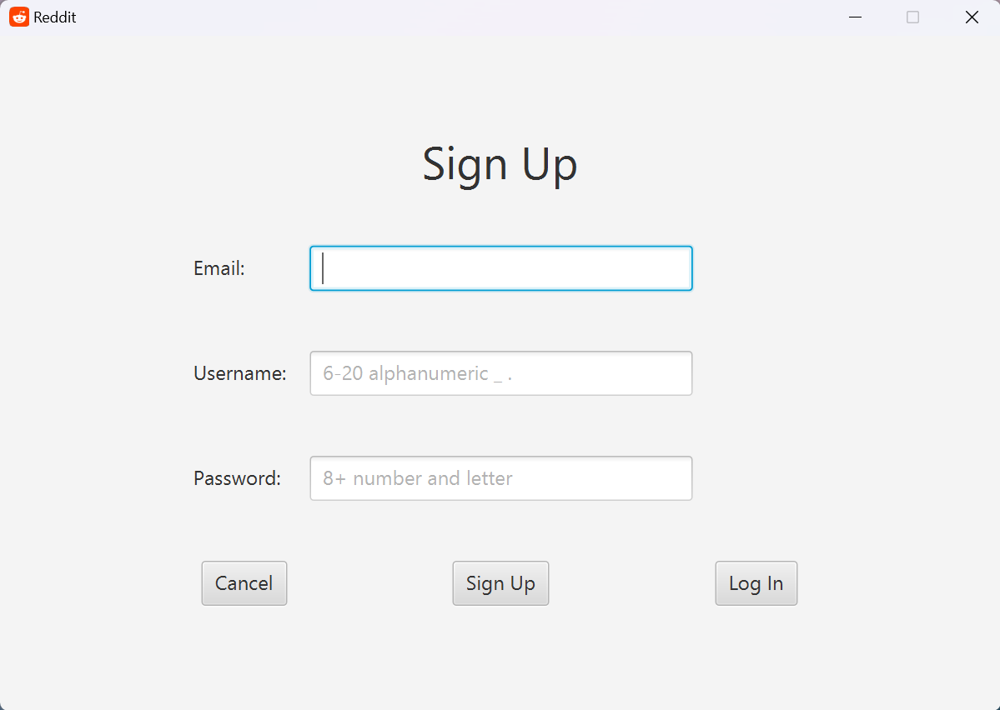
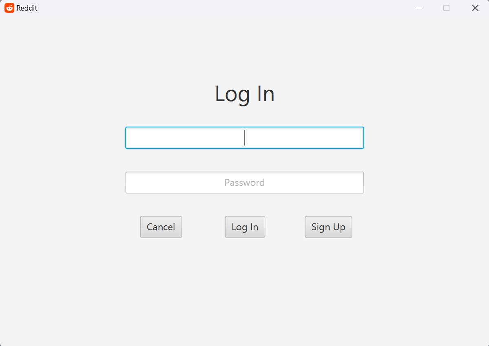
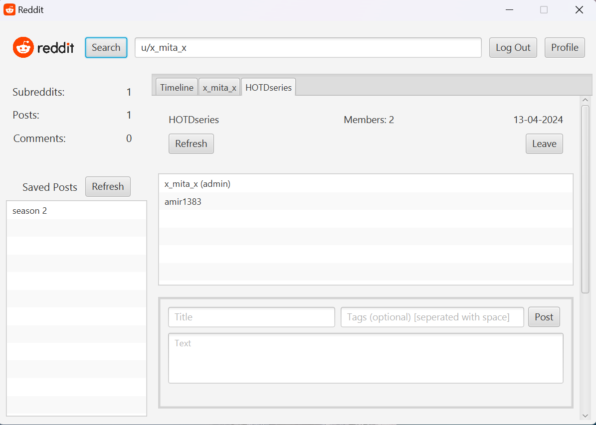
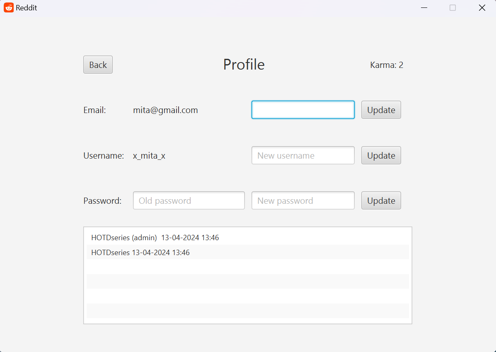
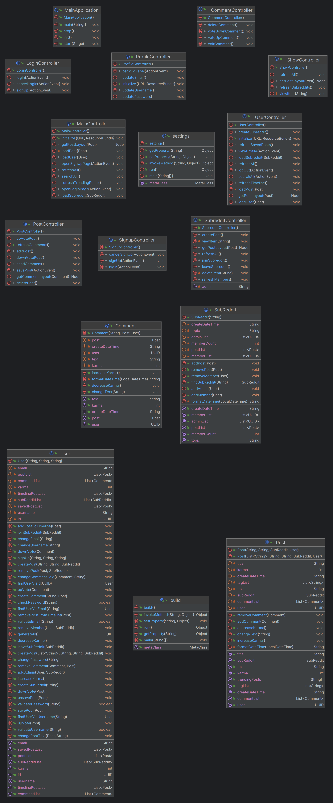

# Reddit


## Description

Reddit Clone is a simple JavaFX application inspired by the popular social media platform Reddit. It allows users to create posts, upvote/downvote posts, and comment on them. The project demonstrates basic UI design, event handling, and data management.

### Features

- Create new posts with titles and content.
- Upvote or downvote posts.
- View post details, including comments.
- Add comments to posts.
- Sort posts by popularity (based on votes).

### Screenshots








### Structure



## Getting Started

You can download the latest release on this github page

### Dependencies

- Windows 10 or later (Mac OS or Linux is not guaranteed)
- Apache DigestUtils 1.16.1 or later
- Java SE Runtime 8 or later
- Javafx library v1.8

### Installation and Execution

1. Download release from [this link]()
2. Go to file directory and launch it useing the following command
```java -jar Reddit.jar```
3. Enjoy app!

###

GUI is designed simple! 

You can take a look at welcome tab while opening the app, login or signup and then use every feature of user panel such as creating or joining - or ever leaving - subreddits, work with posts and comments and change your credentials.

In order to search users or subreddits, use u/ or r/ prefixes and press button.

Press enter key to confirm any changes to post text or comment text

Use right click of mouse to see context menu of options in list views

## Authors

Amin Ghoorchian

[Contact on Telegram](https://t.me/AminGh05)

## Version History

- 1.0.1
  - bug fixes, errors handled and improved features

- 1.0.0
  - first stable version with full gui features and functionality
 
## Acknowledgements

- [SBU Mathematics and Computer Science Department](https://mathsci.sbu.ac.ir/)
- [Shayan Shahrabi (As Mentor)](https://github.com/ShayanShahrabi)
- [Oracle Documentations](https://docs.oracle.com/)
- [Sajjad Zangeneh for guidance on Storing data](https://github.com/SrgtSajjad)
- [Danial Taghipoor for inspiration on Storing data](https://github.com/TheDanielTp)
